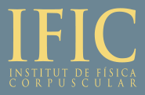

# ific-dune-saorme
Repository of Samuel Ortega during JAE INTRO scholarship.

  
   

Here you can find:
 - Code for waveforms analysis: visualizating plots, baseline calculation, charge histogram and obtaining the gain with several methods.
 - Code for dichroic filters: angular characterization, uniformity study and lamp stability.
 - Code for humidity and temperature sensors interpretation: downsampling, timestamp matching, plateau detection and error estimation.

 Further descriptions of the set-ups can be found in: https://go.uv.es/saorme/dune-logbook

 Data files can be requested to ortegasamuel777@gmail.com.

Author: Samuel Ortega

Last rev.: 29/09/2023
